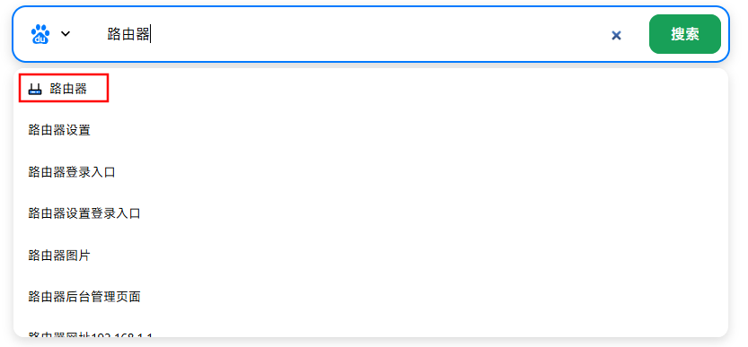

# 支持设置快捷方式快速调用搜索引擎
### 刚刚学习VUE结合AI糊出来的项目
## 后端代码

[nav_server](https://github.com/zw-sch/nav_server)

## Project Setup

```sh
npm install
```

### Development

```sh
npm run dev
```

### build

```sh
npm run build
```
### Server Address Setting
```
src\utils\request.ts
baseURL: ''
```

# 截图
## 1.搜索功能
### 未登录只能使用百度,默认搜索引擎可以在前端代码中替换


### 登录后可以完全功能

### 主页上的组件可以关闭

### 关闭书签和热搜组件搜索框会居中显示

### 使用快捷命令快速调用搜索引擎,跳转引擎主页,支持搜索热词补全


比如设置了google搜索引擎的快捷命令为`/g`那么在搜索框输入`/g`回车直接跳转到google的主页,输入`/g 搜索内容`跳转谷歌搜索输入的内容,

跳转主页这个功能在主页和搜索地址不是一样的时候比较好用比如B站点的首页是www.bilibili.com搜索地址是search.bilibili.com这样既可以快速跳转首页也可以快速搜索内容

### 搜索内容优先匹配书签,如果命中书签回车直接跳转第一个

### 一键切换极简模式

### 支持夜间模式
## 热搜榜(组件支持闭合或展开查看更多数据)

快速浏览热点新闻,支持iframe的网站可以开启预览,有感兴趣的在点击查看


不支持iframe的网站的链接也做了一个简单卡片


目前支持使用 [桑帛云的聚合热榜API](https://api.lolimi.cn/doc-api_xfcj.html)

还有开源的今日热榜[imsyy/DailyHotApi](imsyy/DailyHotApi) (需要自己部署)
# 感谢这些大佬的项目

## 3.书签组件(组件支持闭合或展开查看更多数据)
解决自己在不同设备之间切换的书签问题,还有越来愈多的内网服务根本记不住端口
支持简单的分类和内网外网切换
内网模式可以显示外网书签,外网模式不显示只有内网地址的书签

## 4.简单的天气显示
使用的是高德开放平台的免费API足够个人使用,获取的数据简单
## 5.移动端支持友好

## 6.支持WEBAPP模式

# todoist(学到哪做到哪)

- [ ] 上传自定义图标
- [ ] 更友好的排序方法
- [ ] 自动识别内外网
- [ ] 热搜源支持RSS
- [ ] DOCKER部署
